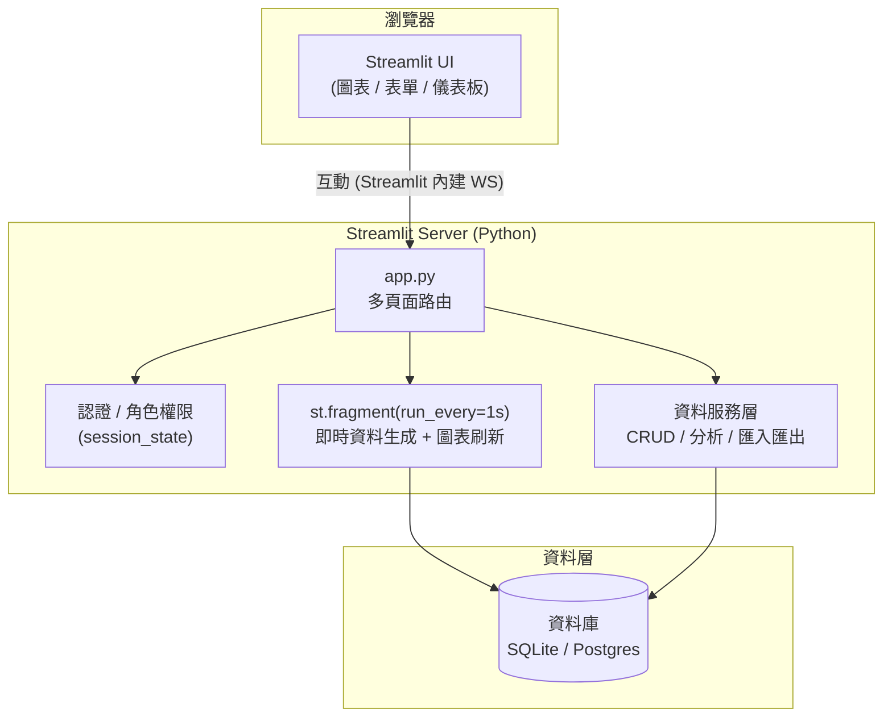
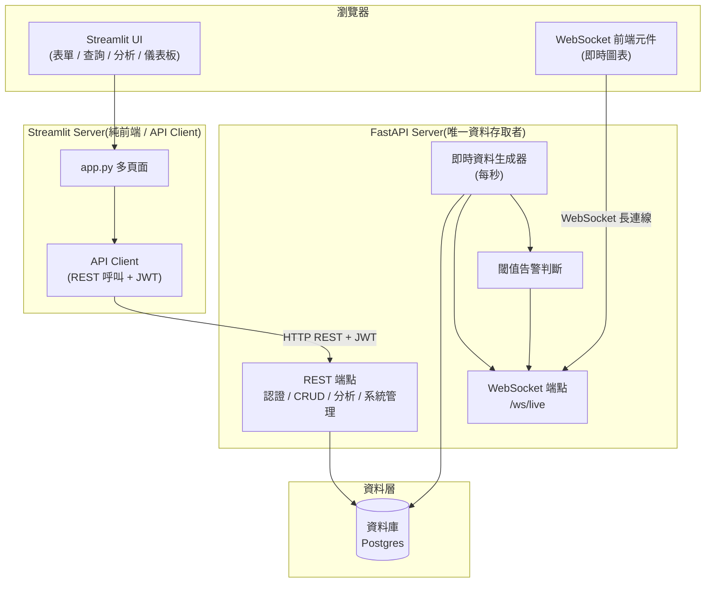

# 技術架構

StreamSight 的技術架構。針對「即時監控」是否需要**真正的 WebSocket 推送**,提供兩種方案。

---

## 方案 A:純 Streamlit(未採用,以定時輪詢模擬即時)

適合「畫面每秒自動更新」即可、不強制要求 WebSocket 的情境。架構最單純。

**即時流程**:`st.fragment(run_every="1s")` 每秒重跑該片段 → 產生/讀取最新資料 → 重畫圖表。這是**輪詢**,非伺服器主動推送。

---

## 方案 B:Streamlit(純 API Client)+ FastAPI(採用)

**採用方案**(見 [ADR 0001](decisions/0001-realtime-architecture.md)、[ADR 0002](decisions/0002-streamlit-as-api-client.md))。Streamlit 為**純前端 / API Client**,不直接連 DB;**FastAPI(StreamSightBackend)是唯一資料存取者**,同時提供 REST 端點(認證 / CRUD / 分析 / 系統管理)與即時資料生成 + WebSocket 推送。

**資料流程**:Streamlit 所有資料操作(登入 / CRUD / 查詢 / 分析 / 系統管理)一律經 API Client 呼叫 FastAPI REST 端點,由 FastAPI 存取 DB 後回傳;Streamlit 端不持有 DB 連線。

**即時流程**:FastAPI 生成器每秒產生資料 → 寫入 DB 並透過 `/ws/live` 主動推送 → 前端 WebSocket 元件即時更新圖表;超閾值時一併推送告警。

---

## 模組對應

| 模組 | 負責元件(方案 A) | 負責元件(方案 B,採用) |
|---|---|---|
| 2. 資料管理 | Streamlit 服務層 + DB | FastAPI REST API(Streamlit 呼叫) |
| 3. 即時監控 | `st.fragment` 輪詢 | FastAPI WebSocket 推送 |
| 4. 資料分析 | Streamlit 服務層 + DB | FastAPI REST API(Streamlit 呼叫) |
| 5. 系統管理 | Streamlit 服務層 + DB | FastAPI REST API(Streamlit 呼叫) |
| 1. 認證 | Streamlit 自行雜湊 / 查 DB | FastAPI 認證 API(JWT) |

## 技術選型建議

- **資料庫**:僅由 FastAPI 存取(開發 SQLite / 正式 Postgres);Streamlit 端不連 DB。
- **API Client**:Streamlit 以 `httpx`(或 `requests`)呼叫後端 REST,統一帶 JWT。
- **認證**:走 FastAPI 認證 API 取得 JWT,存於 `st.session_state`;**不使用 `streamlit-authenticator`、不在前端雜湊密碼**。
- **圖表**:`st.line_chart` / `st.bar_chart`,進階用 Plotly。
- **Excel 匯出**:以 API 取回的資料在前端用 `openpyxl` 產生,或呼叫後端匯出端點。
- **即時**:採方案 B,FastAPI WebSocket 推送。

> 兩方案的取捨背景詳見 [功能能力對照](specs/feature-capability.md)。
