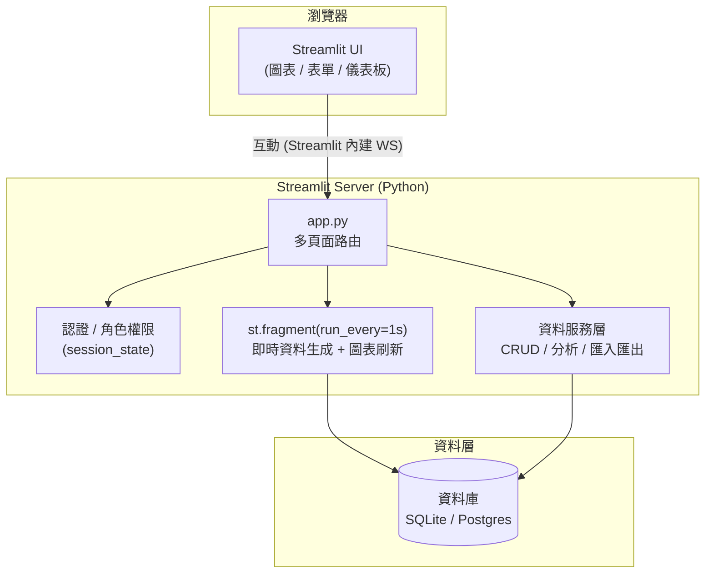
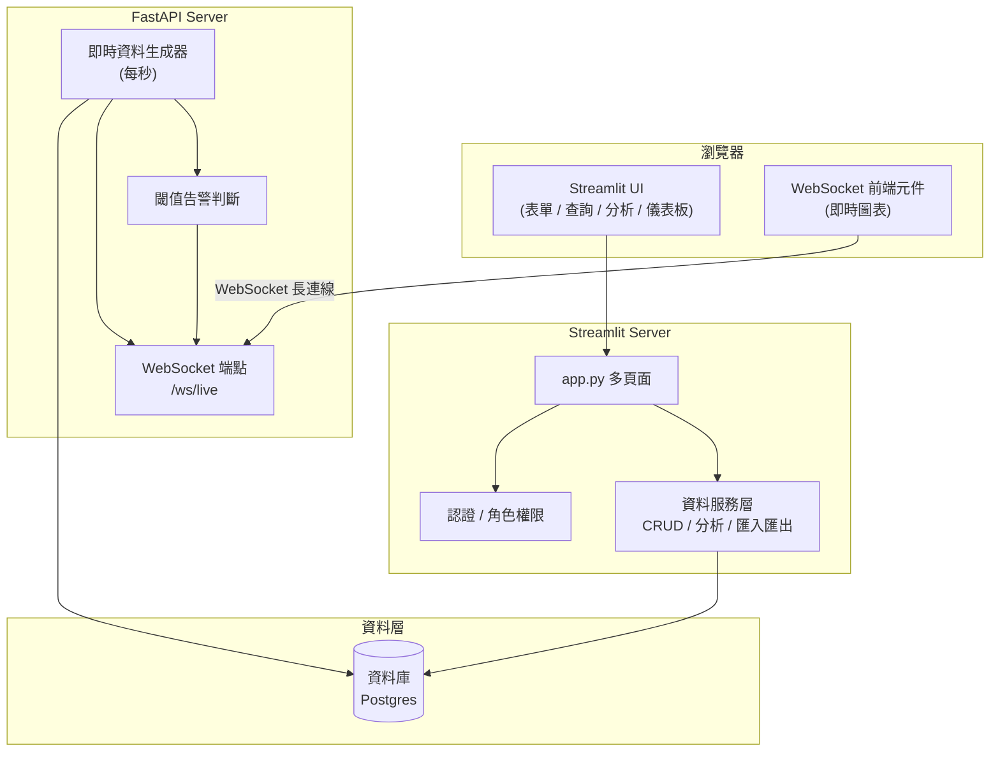

# 技術架構

StreamSight 的技術架構。針對「即時監控」是否需要**真正的 WebSocket 推送**,提供兩種方案。

---

## 方案 A:純 Streamlit(以定時輪詢模擬即時)

適合「畫面每秒自動更新」即可、不強制要求 WebSocket 的情境。架構最單純。

**即時流程**:`st.fragment(run_every="1s")` 每秒重跑該片段 → 產生/讀取最新資料 → 重畫圖表。這是**輪詢**,非伺服器主動推送。

---

## 方案 B:Streamlit + FastAPI(真正的 WebSocket 推送)

當規格書把 **WebSocket** 列為硬性需求時採用。由 FastAPI 負責即時資料生成與 WebSocket 推送,Streamlit 專注 UI/查詢/分析,兩者共用同一 DB。

**即時流程**:FastAPI 生成器每秒產生資料 → 寫入 DB 並透過 `/ws/live` 主動推送 → 前端 WebSocket 元件即時更新圖表;超閾值時一併推送告警。

---

## 模組對應

| 模組 | 負責元件(方案 A) | 負責元件(方案 B) |
|---|---|---|
| 2. 資料管理 | Streamlit 服務層 + DB | Streamlit 服務層 + DB |
| 3. 即時監控 | `st.fragment` 輪詢 | FastAPI WebSocket 推送 |
| 4. 資料分析 | Streamlit 服務層 + DB | Streamlit 服務層 + DB |
| 5. 系統管理 | Streamlit 服務層 + DB | Streamlit 服務層 + DB |

## 技術選型建議

- **資料庫**:開發用 SQLite;正式/多人用 Postgres。
- **認證**:`streamlit-authenticator` 或 Streamlit 原生 `st.login`(OIDC),角色存 users 表。
- **圖表**:`st.line_chart` / `st.bar_chart`,進階用 Plotly。
- **Excel 匯出**:`openpyxl` + `st.download_button`。
- **即時**:優先方案 A;若硬性要求 WebSocket 才上方案 B。

> 兩方案的取捨背景詳見 [功能能力對照](specs/feature-capability.md)。
