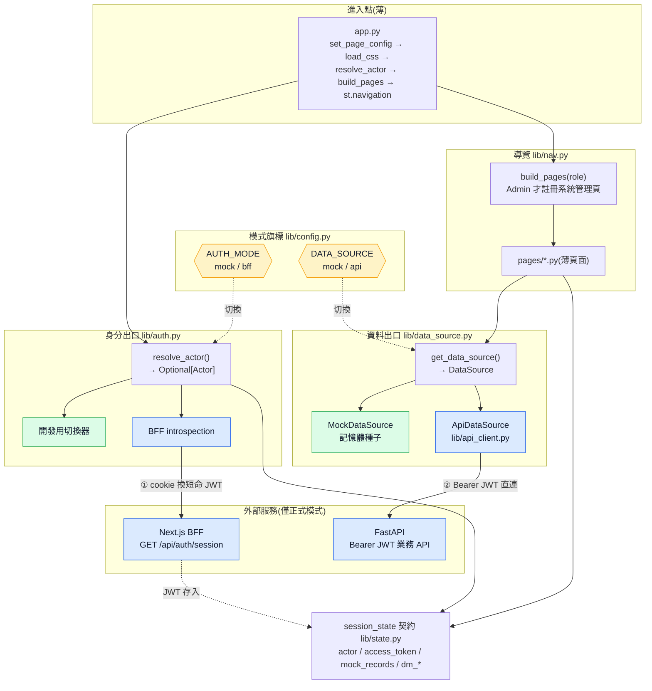

# 規格:應用骨架 / 基礎架構(Walking Skeleton)

本規格定義 StreamSight Streamlit 前端的**最小可運行骨架**:進入點 `app.py`、導覽與頁面註冊、`lib/` 分層、`session_state` 契約、執行模式旗標,以及**不接後端也能端到端跑起來**的 mock 先行機制。

- 定位:把 [architecture.md](../architecture.md)(系統層)落到**應用層骨架**;各功能細節委派下列既有規格,本檔只負責「**如何接起來**」。
- 委派:[認證流程](auth-flow.md)、[資料來源抽象層](data-source.md)、[設計系統](design-system.md)、[前端頁面結構](frontend-pages.md)、各[頁面規格](pages/)。
- 前提:[ADR 0002](../decisions/0002-streamlit-as-api-client.md)(純 API Client)、[ADR 0003](../decisions/0003-auth-via-bff-token-exchange.md)(認證 Design B)。

---

## 1. 目的與設計原則

**目的**:先立一個「能走的骨架」——最小端到端可運行的 app(進入點 + 導覽 + 一頁 + 假身分 + 假資料 + 測試),之後每個模組往骨架上長,而非最後才整合。

**設計原則**
1. **Walking Skeleton 先行**:第一里程碑是「`streamlit run app.py` 能進到資料管理頁、看到 mock 資料」,不是先把單一頁做完美。
2. **薄進入點**:`app.py` 只排版與委派,所有邏輯在 `lib/`(對齊 CLAUDE.md 可測試性)。
3. **模式旗標大致獨立**:資料來源(`DATA_SOURCE`)與認證(`AUTH_MODE`)各自可切 mock/真實;dev 預設全 mock,**不依賴 BFF 與後端即可跑**。**唯一限制**:`DATA_SOURCE=api` 需搭 `AUTH_MODE=bff`(業務 API 需 JWT,僅 bff 有),`api+mock` 為無效組合(見 §2、[api-client §1](api-client.md#1-職責與分層))。
4. **單一身分出口**:不論 mock 或 BFF,身分都收斂成 `Actor` 寫入 `session_state["actor"]`,使 `app.py` 兩模式共用同一流程。
5. **相容 Python 3.9**:型別註記用 `Optional[...]`/`List[...]` 或 `from __future__ import annotations`。

### 架構總覽圖

薄進入點 `app.py` 透過兩個出口(`resolve_actor` / `get_data_source`)委派;兩出口各由旗標切換 mock(綠,dev)或真實(藍,正式)實作,上層頁面與進入點不隨模式改變。



- **綠色 = dev 全 mock 路徑**:`resolve_actor` 走切換器、`get_data_source` 回 `MockDataSource`,不觸及 Next.js / FastAPI。
- **藍色 = 正式路徑**:`bff` 先向 Next.js 換短命 JWT(存 `session_state`)→ `ApiDataSource` 帶 Bearer 直連 FastAPI(見[認證流程](auth-flow.md))。
- **黃色 = 旗標**:只切換兩個出口的實作,`app.py` 與 `pages/*` 不變。

---

## 2. 執行模式與旗標

以環境變數控制,`lib/config.py` 統一讀取;dev 可放 `.streamlit/secrets.toml` 或 `.env`。

| 旗標 | 值 | 預設 | 影響 |
|---|---|---|---|
| `DATA_SOURCE` | `mock` / `api` | `mock` | `get_data_source()` 回 `MockDataSource` 或 `ApiDataSource`(見[資料來源規格](data-source.md)) |
| `AUTH_MODE` | `mock` / `bff` | `mock` | `resolve_actor()` 走「開發切換器」或「BFF introspection」(見[認證流程](auth-flow.md)) |

合法組合(4 種取 3,`api+mock` 無效):

| `DATA_SOURCE` | `AUTH_MODE` | 合法 | 用途 |
|---|---|---|---|
| `mock` | `mock` | ✅ | dev:無需登入 / 後端,進站即有假身分與假資料 |
| `api` | `bff` | ✅ | 正式:真身分 + 真資料 |
| `mock` | `bff` | ✅ | 分階段整合:真身分 + 假資料 |
| `api` | `mock` | ❌ | 業務 API 需 JWT,mock 無 token → `get_data_source()` **啟動即拋錯**(見 [api-client §1](api-client.md#1-職責與分層)) |

---

## 3. 進入點 `app.py` 職責與順序

`app.py` 是唯一進入點,**每次 rerun 依固定順序執行**:

```python
# app.py(概念,非最終碼)
import streamlit as st
from lib.theme import load_css
from lib.auth import resolve_actor          # 兩模式共用出口
from lib.nav import build_pages, render_dev_switcher

st.set_page_config(page_title="StreamSight", layout="wide",
                   initial_sidebar_state="expanded")   # ① 頁面設定(必須最先)
load_css()                                              # ② 載入一次 CSS

actor = resolve_actor()                                 # ③ 身分解析(見 §4)

if actor is None:                                       # ④ 未登入(僅 AUTH_MODE=bff 會發生)
    st.navigation([st.Page("pages/gate.py")]).run()     #    只註冊導向頁 → 結束
    st.stop()

render_dev_switcher(actor)                              # ⑤ 側邊欄開發切換器(僅 AUTH_MODE=mock)
pages = build_pages(actor.role)                         # ⑥ 依 role 動態組頁清單(見 §5)
st.navigation(pages).run()                              # ⑦ 交給 Streamlit 路由
```

**順序要點**
- ① `set_page_config` 必須在任何輸出前呼叫。
- ② CSS 載入一次(見[設計系統](design-system.md));每次 rerun 重注入無副作用。
- ③ 身分解析是 gate:失敗即只給導向頁,**不註冊任何業務頁**(比隱藏更安全)。
- ⑤ 開發切換器只在 `AUTH_MODE=mock` 出現;正式模式不存在。

---

## 4. 身分解析(`resolve_actor`)——兩模式單一出口

`lib/auth.py` 對外只暴露一個函式,回傳 `Optional[Actor]`,吸收兩種模式差異:

| `AUTH_MODE` | `resolve_actor()` 行為 | 回傳 |
|---|---|---|
| `mock` | 讀 `session_state["actor"]`;若無則預設 `Actor("alice", "user")`(供切換器改) | **恆有** `Actor`(mock 不會未登入) |
| `bff` | 讀 cookie → BFF `GET /api/auth/session` → 解析(見 [auth-flow §4](auth-flow.md));401/無 cookie → `None` | `Actor` 或 `None` |

- `Actor` 型別定義見[資料來源規格 §資料契約](data-source.md#資料契約型別定義):`{username: str, role: "user"|"admin"}`。
- **關鍵**:`app.py` 只看 `resolve_actor()` 的結果,不關心來源;換認證模式時 `app.py` 不改。
- `bff` 模式的 token / 快取 / refresh 全在 `lib/auth.py` + `lib/api_client.py` 內處理(見 auth-flow),不外溢到 `app.py`。

---

## 5. 導覽與頁面註冊(`build_pages`)

以 `st.navigation` + `st.Page` 組合,依 role **動態註冊**(見[前端頁面結構](frontend-pages.md)):

```python
# lib/nav.py(概念)
def build_pages(role: str) -> list:
    pages = [
        st.Page("pages/dashboard.py",        title="儀表板",   default=True),
        st.Page("pages/data_management.py",  title="資料管理"),
        st.Page("pages/realtime_monitor.py", title="即時監控"),
        st.Page("pages/analytics.py",        title="資料分析"),
    ]
    if role == "admin":                        # 非 Admin 動態不註冊(不是隱藏)
        pages.append(st.Page("pages/admin.py", title="系統管理"))
    return pages
```

- **存取控制**:系統管理頁**僅 Admin 出現在頁清單**;非 Admin 連路由都沒有,此行為需 AppTest 覆蓋。
- 骨架階段允許其他業務頁為 placeholder(`st.info("建置中")`),先讓導覽與 gate 成立。

---

## 6. `lib/` 分層總表(單一入口地圖)

各模組職責與**詳規所在**;本表為地圖,細節不在此重複。

| 檔案 | 職責 | 詳規 | 骨架必要? |
|---|---|---|---|
| `lib/config.py` | 讀環境旗標與設定(`DATA_SOURCE`/`AUTH_MODE`、BFF/API base URL、cookie 名、逾時) | 本檔 §2、auth-flow §6 | ✅ |
| `lib/theme.py` | `load_css()` 載入樣式 | [設計系統](design-system.md) | ✅ |
| `lib/state.py` | `session_state` 讀寫 helper(見 §7 契約) | auth-flow §6 | ✅ |
| `lib/auth.py` | `resolve_actor()` 身分解析(mock/bff 出口)、role 映射;對 api_client 的接縫 `get_access_token()`/`refresh_token()`/`raw_cookie()` | [Auth 模組](auth.md)、[認證流程](auth-flow.md) | ✅ |
| `lib/nav.py` | `build_pages(role)`、`render_dev_switcher()`、導向登入 helper | 本檔 §5、auth-flow §4.4 | ✅ |
| `lib/models.py` | `Actor`/`Record`/`Page`/`ImportResult`、`CATEGORIES`、`can_edit()`、例外 | [資料來源](data-source.md) | ✅ |
| `lib/data_source.py` | `DataSource`(Protocol)+ `get_data_source()` 工廠 | [資料來源](data-source.md) | ✅ |
| `lib/mock_data_source.py` | `MockDataSource`(記憶體種子) | [資料來源](data-source.md) | ✅ |
| `lib/api_client.py` | `ApiDataSource` + BFF/FastAPI 呼叫(帶 JWT)、`ApiError`、逾時/重試 | [API Client](api-client.md) | ⬜(接 API 階段) |
| `lib/request_id.py` | 對外呼叫的 `X-Request-ID` 關聯 ID(產生/附掛/讀回) | [Request ID 模組](request-id.md) | ⬜(接 API 階段) |

---

## 7. `session_state` 契約(單一真相)

跨頁共用的 key 集中規範;**頁面私有狀態以頁前綴命名**避免碰撞。經 `lib/state.py` 存取,不散寫字串 key。

| Key | 型別 | 由誰寫 | 適用模式 | 說明 |
|---|---|---|---|---|
| `actor` | `Actor` | `resolve_actor` / 開發切換器 | 全部 | 目前操作者(§4) |
| `access_token` | `Optional[str]` | `lib/auth.py` | `AUTH_MODE=bff` | 短命 JWT,僅記憶體,不落檔/log |
| `token_expires_at` | `Optional[int]` | `lib/auth.py` | `bff` | epoch ms,提前 refresh 判斷 |
| `mock_records` | `List[Record]` | `MockDataSource` | `DATA_SOURCE=mock` | 記憶體假資料,重啟還原 |
| `dm_page` | `int` | 資料管理頁 | 全部 | 列表當前頁(1-based) |
| `dm_filters` | `dict` | 資料管理頁 | 全部 | `{category, keyword, sort, date_range}` |
| `dm_editing_id` | `Optional[int]` | 資料管理頁 | 全部 | 編輯彈窗目標;`None`=未開 |
| `last_request_id` | `Optional[str]` | `lib/api_client.py` | `api`/`bff` | 最近一次失敗呼叫的 `X-Request-ID`,供錯誤畫面顯示(見 [Request ID 模組](request-id.md)) |

- 前綴約定:資料管理 `dm_`、即時監控 `rt_`、分析 `an_`、系統管理 `admin_`。
- 清理:登出(bff)或切換使用者(mock)時,清掉 `access_token`、頁面私有狀態與相關快取。

---

## 8. 目錄結構與 bootstrap

```
app.py                      # 進入點(§3)
pages/                      # 檔名對齊 CLAUDE.md(無編號);順序由 build_pages 顯式決定
├── gate.py                 # 未登入導向頁(僅 bff 未登入時註冊)
├── dashboard.py            # 儀表板(骨架可為 placeholder)
├── data_management.py      # 資料管理(第一個實作的業務頁)
├── realtime_monitor.py     # 即時監控(placeholder)
├── analytics.py            # 資料分析(placeholder)
└── admin.py                # 系統管理(僅 Admin)
lib/                        # 見 §6
styles/main.css             # 共用 CSS
.streamlit/
├── config.toml             # 主題(見設計系統)
└── secrets.toml            # dev 旗標(不入版控)
tests/
├── conftest.py             # 共用 fixtures(§9)
├── unit/                   # lib 純邏輯
└── app/                    # AppTest 頁面行為
requirements.txt
```

**bootstrap 指令**(對齊 CLAUDE.md)
```bash
python -m venv .venv && source .venv/bin/activate
pip install -r requirements.txt
pytest                      # TDD 主迴圈
streamlit run app.py        # 全 mock 下即可跑
```

- `requirements.txt` 核心:`streamlit`、`pandas`、`pytest`(接 API 階段再加 `httpx`)。本機為 Python 3.9,安裝時由 pip 解析相容版本並回寫版本號。
- **不得用 Homebrew 安裝**(CLAUDE.md);一律 `pip` + `requirements.txt`。

---

## 9. 測試骨架(對齊 TDD)

`tests/conftest.py` 提供共用 fixtures,讓 unit 與 AppTest 都不打真後端:

| Fixture | 用途 |
|---|---|
| `seeded_mock_source` | 帶決定性種子的 `MockDataSource`,供 unit 直接斷言 |
| `actor_user` / `actor_admin` / `actor_other` | 三種 `Actor`,測權限分支 |
| `app_at` | `AppTest.from_file("app.py")`,預設 `AUTH_MODE=mock`/`DATA_SOURCE=mock`,可注入指定 actor |

- **unit**(`tests/unit/`):`can_edit`、`MockDataSource` CRUD/分頁/篩選、`resolve_actor`(mock 分支)、`build_pages`(role→頁清單)、`config` 讀旗標。
- **app**(`tests/app/`):進站顯示導覽、切換使用者後按鈕停用、非 Admin 無系統管理頁、bff 未登入停在導向頁。

---

## 10. Walking Skeleton 的 TDD 落地順序

每步先寫失敗測試 → 最小實作 → 綠燈重構(golden rule):

1. `lib/config.py`:讀 `DATA_SOURCE`/`AUTH_MODE`,預設 `mock`。(unit)
2. `lib/models.py`:`Actor` + `can_edit(record, actor)`。(unit)
3. `lib/auth.py`:`resolve_actor()` mock 分支(預設 `alice/user`、可被 session 覆寫)。(unit)
4. `lib/nav.py`:`build_pages(role)`——`user` 無系統管理頁、`admin` 有。(unit)
5. `app.py` + `AppTest`:全 mock 下進站顯示導覽、預設落在儀表板。(app)
6. `MockDataSource.list_records` + `pages/data_management.py`:資料管理頁能列出種子資料。(unit + app)
7. 之後接續資料管理其餘 CRUD(見 [data-source §落地順序](data-source.md#對齊-tdd-的落地順序))。

**骨架完成定義(Definition of Done)**
- `streamlit run app.py`(全 mock)能進站、看到導覽與資料管理頁的 mock 資料。
- 切換 dev 使用者能改變「編輯/刪除」按鈕停用狀態。
- 非 Admin 無「系統管理」頁。
- `pytest` 全綠。

---

## 11. 未決 / 待確認

- `AUTH_MODE` / `DATA_SOURCE` 的旗標名稱與 dev 設定放置位置(`secrets.toml` vs `.env`)——本規格採 `secrets.toml`,如需 `.env` 再調。
- ~~頁面檔名前綴是否統一~~ **已定**:採 CLAUDE.md 無編號慣例(`dashboard.py`/`data_management.py`/`realtime_monitor.py`/`analytics.py`/`admin.py`+`gate.py`),順序由 `build_pages` 顯式決定,不靠檔名。
- placeholder 業務頁的最小內容(`st.info("建置中")`)是否需要各自最小規格——骨架階段先不立。
