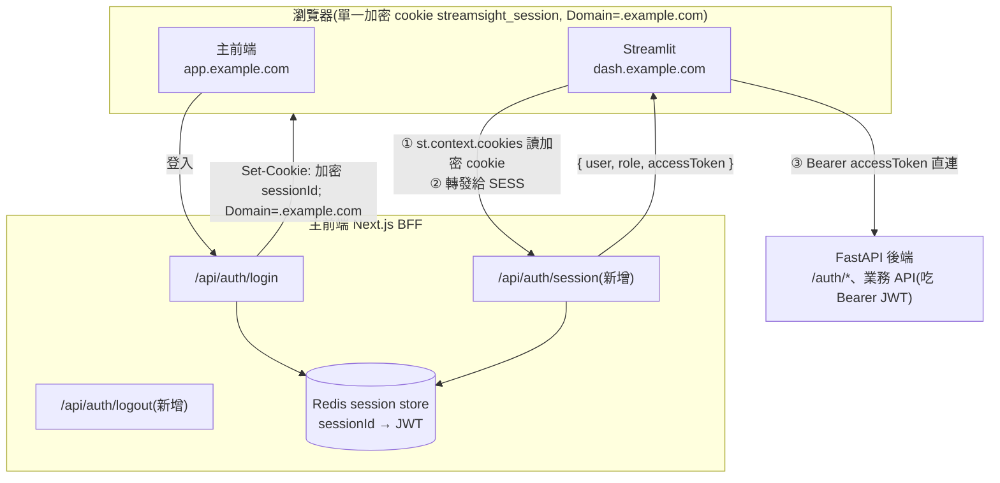

# 認證流程規格:跨 App SSO(共享 BFF Session Cookie)

- 對應模組:模組 1 認證
- 關聯:[ADR 0002](../decisions/0002-streamlit-as-api-client.md)、[頁面規格:登入 / 註冊](pages/01-login.md)、[前端頁面結構](frontend-pages.md)
- 前端(主前端 BFF)參考:`StreamSightFrontend/docs/specs/001-bff-infrastructure.md` 及其子 spec `001b`(session-store)、`001c`(session-service)、`001d`(csrf)、`001g`(routes)
- 後端參考:`StreamSightBackend`(FastAPI,JWT Bearer,`/auth/login`、`/auth/me`、`/auth/refresh`)
- 狀態:**已定案(v3)——採 Design B**:Streamlit 用加密 cookie 向 BFF **換一顆短命 JWT**,再帶 Bearer 直連 FastAPI;**完全不碰 Redis、不持有 `SESSION_SECRET`**。決策見 [ADR 0003](../decisions/0003-auth-via-bff-token-exchange.md)

---

## 0. 本次改版重點(與舊草稿的關鍵差異)

舊草稿假設「Streamlit 直接讀到明文 `sessionId` cookie,再拿它打後端 `/auth/me`」。**實際考察主前端(`StreamSightFrontend`,Next.js BFF)後,這個假設不成立**,必須修正:

| 項目 | 舊草稿假設 | 實際架構(本規格採用) |
|---|---|---|
| Cookie 內容 | 明文 opaque `sessionId` | **iron-session 加密封裝** `{ sessionId }`,以 `SESSION_SECRET` 加密簽章 |
| Streamlit 能否解出 sessionId | 能 | **不能**(沒有 `SESSION_SECRET`、不重寫 iron-session 解封演算法) |
| 誰寫 cookie | FastAPI 後端 | **Next.js BFF**(iron-session `Set-Cookie`),FastAPI 完全不碰 cookie |
| JWT 存放 | 前端保管 | **只存在 BFF 的 Redis + BFF↔FastAPI 之間**,不進瀏覽器 |
| Streamlit 呼叫後端時 cookie 會自動夾帶嗎 | 會 | **不會**——api_client 的請求由 Streamlit **伺服器端**發出,不經瀏覽器 cookie jar |
| 驗證端點 | 直接打 FastAPI `/auth/me` | FastAPI `/auth/me` 只吃 **Bearer JWT**,不吃 cookie;Streamlit 手上沒有 JWT → 必須先向 **BFF 換取身分與 token** |

**核心結論**:Streamlit **無法自行驗證 cookie**。它只能把瀏覽器送來的加密 cookie **原封轉發給 BFF**,由 BFF(持有 `SESSION_SECRET`、能查 Redis、能 refresh JWT)解封並回傳身分。因此本方案需要主前端 **新增一個 introspection 端點**。

---

## 1. 目的與範圍

> ### 🔒 首要設計目標:瀏覽器永遠拿不到 JWT
>
> 本規格所有流程與取捨的**第一因**:JWT(FastAPI 的 Bearer access token)**全程不進瀏覽器**,只存在 **Streamlit Python server 記憶體**(`session_state`,不落檔 / log / 渲染)。「共享 cookie SSO」「向 BFF 換 token」「token 只存 server」等設計,都是為了守住這一條;評估任何替代方案時,**先問「會不會讓 JWT 暴露到瀏覽器」**。詳見 [ADR 0003](../decisions/0003-auth-via-bff-token-exchange.md)。

讓 **Streamlit(資料儀表板)** 與 **主前端(Next.js)** 共享同一顆 BFF session cookie,使用者在主前端登入後,進 Streamlit **免再次登入**(簡易 SSO)。

本規格定義:

- 網域佈署硬性前提(§2)
- 需要主前端新增的端點契約(§3)
- Streamlit 端每次 rerun 的辨識、取 token、呼叫 FastAPI、refresh、登出流程(§4)
- Streamlit 端模組分層與 TDD 測試計畫(§6、§8)
- 安全性要點(§7)

**不在本規格範圍**:主前端內部 iron-session / Redis / refresh 實作(見前端 spec 001)、後端 JWT 簽發(見後端 spec)、各業務頁面的資料端點。

### 1.1 設計原則:職責邊界(最小權限)

本方案的核心原則:**難的、危險的東西全部關在 BFF;Streamlit 退回成最薄的 HTTP client,只拿它需要的那一顆短命 token。**

| | 碰 `SESSION_SECRET`(解封 cookie) | 碰 Redis(session 真相) | 做 refresh | 手上持有 |
|---|---|---|---|---|
| **Streamlit** | ❌ | ❌ | ❌(交給 BFF) | 一顆短命、可撤銷的 access token |
| **主前端 BFF** | ✅ | ✅ | ✅ | 全部(解封 + session 真相 + refresh 協調) |

- Streamlit **只做三件事**:① 讀 cookie → ② 打 BFF 換 token → ③ 帶 Bearer 打 FastAPI。
- **為什麼「直接換 JWT」而不是「換 sessionId 再自己讀 Redis」**:後者會讓 Streamlit 取得**整個 Redis 的讀取權限**(`:session:*` 全部,遠超它需要的單一 session),違反最小權限——一旦 Streamlit 被攻破,即可讀走**全體使用者的 30 天 refresh token**。**只換 token** 把爆炸半徑框在**一顆短命、可撤銷**的 access token。詳細否決分析見 [ADR 0003](../decisions/0003-auth-via-bff-token-exchange.md)。

---

## 2. 硬性前提(成敗關鍵,部署前必須確認)

### 2.1 同父網域

Cookie 綁**網域**而非 App。兩 App 能否共享 cookie 完全取決於瀏覽器眼中的網域關係:

| 佈署方式 | 範例 | 能否共享 | 說明 |
|---|---|---|---|
| **同網域、不同路徑（已定案，2026-07-18）** | `cf.net/`（Next.js）、`cf.net/streamlit`（Streamlit） | ✅ | 預設即共享，無需設 Domain |
| 不同子網域 | `app.example.com`、`dash.example.com` | ✅ | cookie 需帶 `Domain=.example.com`(見 2.2) |
| 完全不同網域 | `myapp.com` vs `mydash.com` | ❌ | 瀏覽器不會把 cookie 送到 Streamlit,**本方案不成立**,需改走 OAuth/SSO redirect 換 code |
| 本機開發 | `localhost:3000`、`localhost:8501` | ✅ | cookie 不分 port,共享 host `localhost` |

> **已定案（2026-07-18）**：Streamlit 與 Next.js 掛同一個 ALB，CloudFront path-based routing（`/` → Next.js；`/streamlit` → Streamlit）。共享同一個 CloudFront domain，前提滿足，**無需額外 cookie 設定**。

### 2.2 前端 cookie `Domain` 設定

**已定案（2026-07-18）**：Streamlit 與 Next.js 同 ALB 不同 path，共享同一個 host，**`SESSION_COOKIE_DOMAIN` 保持空字串即可**，前端 terraform `session_cookie_domain` 無需設定。

若未來改為不同子網域部署，主前端需：
- 新增環境變數（如 `SESSION_COOKIE_DOMAIN=.example.com`），於 `cookieOptions.domain` 帶入。
- 維持 `SameSite=Lax`（同一註冊網域下的子網域屬 same-site，Lax 即可，無需 `None`）。
- 本機 `localhost` 不需設 `Domain`（同 host）。

### 2.3 `st.context.cookies` 能讀到 httpOnly cookie(需先 spike 驗證)

`HttpOnly` 只阻擋**瀏覽器端 JS**(`document.cookie`),**不影響伺服器**:瀏覽器仍會把 cookie 夾在送往 Streamlit server 的請求 header。理論上 `st.context.cookies` 讀得到,但這是整個方案的地基,**實作前先寫一支 spike 親自驗證**(見 §8 spike-1),不要憑推論。

---

## 3. 需主前端新增的端點契約(Design B)

Streamlit 無法解 cookie,故由 BFF 提供 introspection。**採 Design B:BFF 回傳身分 + 短命 access token,Streamlit 拿 token 直連 FastAPI**(最貼合 [ADR 0002]「Streamlit 直連後端、只保管 token」,前端改動最小)。

> **前端現況(已查證 2026-07-18)**:主前端目前僅有 `/api/auth/login`、`/api/auth/register`、`/api/csrf`、`/api/health`(+`/live`),**沒有** session introspection 端點;且現有 login / register **刻意不把 `accessToken` 回給 client**(JWT 只留 Redis + BFF↔FastAPI)。因此本端點**需新增**,並會成為 BFF **首次**把 JWT 交給外部 client——**打破前端「JWT 不出 BFF」的不變式,需前端團隊簽核**(若不接受 → 改走 §5 Design A)。註:前端 login 回應本就已在 body 回傳明文 `sessionId`,故「回傳 opaque 識別」對其非破例;真正需簽核的是「回傳 JWT」這一點。

### 3.1 `GET /api/auth/session`(新增,introspection)

| 項目 | 內容 |
|---|---|
| 方法 | `GET`(safe method → CSRF 豁免,見前端 `001d` §2.2) |
| 認證 | 靠請求帶上的 BFF session cookie(Streamlit 手動轉發,見 §4.2) |
| 行為 | BFF 解封 cookie → 查 Redis → 若 access token 將過期則先 refresh → 回傳身分與 token |
| 快取 | `Cache-Control: no-store, private` |

**成功(200)**:
```json
{
  "data": {
    "user": { "id": "u_123", "name": "alice" },
    "role": 1,
    "adminRole": "super_admin",
    "accessToken": "<JWT>",
    "expiresAt": 1699999999000,
    "csrfToken": "<43-char base64url>"
  }
}
```
- `role`:沿用前端 `Role` enum 的數值(`ADMIN` / `USER`;見前端 `lib/session/types`)。Streamlit 端以 helper 映射成 `"admin"` / `"user"`。本系統為 admin-only,`role` 恆 admin。
- `adminRole`（optional，BFF camelCase **字串** enum）：值為 `'viewer'`/`'editor'`/`'super_admin'`/`'root'`（Next.js `lib/schemas/auth.ts AdminRole`）；login route 將後端整數 rank 轉字串，session route 回傳同一字串。Streamlit 端以 `_BFF_ADMIN_ROLE` dict 映射回 `AdminRole` 整數（`viewer→0`, `editor→50`, `super_admin→100`, `root→999`）;為**存取軸**,供 `can_write`/`build_pages` gate 使用。非 admin 使用者不帶此欄位，Streamlit 解為 `grade=None`。見[前端頁面結構 §存取控制](frontend-pages.md#存取控制本節為存取軸的單一真相)。
- `accessToken`:FastAPI 用的 Bearer JWT。BFF 回傳前若偵測即將過期,應先跑 refresh(前端 `001c` §3 的鎖去重流程),確保回傳的是有效 token。
- `expiresAt`:epoch ms,供 Streamlit 端快取 TTL 與提前 refresh 判斷。
- `csrfToken`:供 Streamlit 發 logout 時帶 `X-CSRF-Token`;存 `session_state["csrf_token"]`,避免登出時需額外打 `/api/csrf`(見 §7.3、015 §2.3)。

**未認證(401)**:無 cookie / 解封失敗 / Redis 無對應 session → `401`,body 為前端標準錯誤封包。Streamlit 收到即視為「未登入」→ 導向主前端登入頁。

> **信任邊界說明(最小權限)**:此端點把 access token 交給 Streamlit,但**只交這一顆**——Streamlit 拿不到 `SESSION_SECRET`、也連不到 Redis。因此即使 Streamlit 被攻破,損害框在**單一使用者、短命(access ~3h)、可撤銷**的 token,而非整個 session store。這正是「直接換 token」相對「換 sessionId 自己讀 Redis」的關鍵優勢(§1.1)。此為**刻意取捨**且與 [ADR 0002]「Streamlit 保管 token」一致,token **不進瀏覽器**。若要求 JWT **絕不進 Streamlit**,改採 §5「Design A」(代價:前端要 proxy 全部資料端點)。
>
> **「JWT 進 Streamlit」指哪一層(避免誤解)**:這裡的「Streamlit」指 **Python server**——JWT 存 `st.session_state["access_token"]`(伺服器端記憶體、per-session、不落檔 / 不 log,見 [app-skeleton §7](app-skeleton.md#7-session_state-契約單一真相))。**瀏覽器端(使用者)全程看不到 JWT**:api_client 由 server 端發出、Bearer 不經瀏覽器 cookie jar,瀏覽器只有那顆加密共享 cookie 與渲染後的 UI。因此兩層要分清:**瀏覽器 = 看不到(安全目標達成);Streamlit server = 記憶體持有這一顆短命 token**。附帶紀律:不得把 token 以 `st.write` / URL / 元件渲染到前端(靠測試覆蓋,對齊上方遮蔽要求)。

### 3.2 `POST /api/auth/logout`(新增)

前端目前也**尚無** logout 端點。需新增:使 Redis session 失效 + `Set-Cookie` 清除(`Max-Age=0`,同 `Domain`)。因 cookie 共享,**單點登出對兩 App 同時生效**。詳見 §4.5。

---

## 4. Streamlit 端認證流程

### 4.1 架構總覽



### 4.2 每次 rerun 的身分辨識(核心流程)

Streamlit 每次互動都重跑整個 script,以下流程**每次 rerun 都會經過,務必快取**(§4.6)。

```mermaid
sequenceDiagram
    participant B as 瀏覽器
    participant S as Streamlit (lib/auth.py)
    participant BFF as 主前端 BFF
    participant API as FastAPI

    B->>S: 互動(HTTP/WS 請求 header 夾帶加密 cookie)
    S->>S: raw = st.context.cookies.get("streamsight_session")
    alt 無 cookie
        S->>B: 導向主前端登入頁(§4.4)
    else 有 cookie
        S->>BFF: GET /api/auth/session<br/>Cookie: streamsight_session=<raw> ＊結果快取
        alt 200
            BFF-->>S: { user, role, accessToken, expiresAt }
            S->>S: 寫入 session_state(user, role, grade);token 僅記憶體
            S->>B: 依 role 動態註冊頁面 + 渲染
        else 401
            BFF-->>S: 未認證
            S->>S: 清除 session_state + 快取
            S->>B: 導向主前端登入頁
        end
    end
```

**要點**:
- Streamlit **不解析、不信任** cookie 內容,只當它是一段不透明字串**原樣轉發**。
- 判斷「有沒有登入」以 **BFF 200/401 為準**,**不是**以「cookie 是否存在」為準(cookie 值可被使用者竄改/偽造,單看存在性不安全)。

### 4.3 呼叫 FastAPI 業務 API + token 過期處理

- api_client 一律帶 `Authorization: Bearer <accessToken>`(來自 §4.2 的 introspection 結果)。
- **反應式 refresh**:若 FastAPI 回 `401`(access token 過期),Streamlit **重新呼叫 `GET /api/auth/session`**(BFF 內部完成 refresh 並回新 token),清掉舊快取後**用新 token 重試原請求一次**;若再 401 → 視為 session 失效 → 導向登入。
- **預先式 refresh(可選)**:若 `expiresAt - now < 門檻`(如 60s),提前重新 introspect,避免打到 401 再重試。

### 4.4 登入(委派主前端,Streamlit 不自建登入表單)

Streamlit 無法 `Set-Cookie`(無 response 物件),登入一律委派 Next.js 主前端。詳見 [ADR 0003](../decisions/0003-auth-via-bff-token-exchange.md)。

流程:
1. Streamlit 偵測未登入(`resolve_actor()` 回 `None`:無 cookie 或 introspection 401)。
2. `app.py` 以 `<meta http-equiv="refresh">` 把瀏覽器整頁導到 Next.js 登入頁:
   - 目標:`BFF_BASE_URL + BFF_LOGIN_PATH`(預設 `http://localhost:3000/login`)。
   - **無獨立 `gate.py` 頁面**;邏輯直接在 `app.py` 的 `actor is None` 分支。
3. 使用者在主前端登入成功 → BFF 種下共享 cookie。
4. Streamlit 重跑 → cookie 已在 → introspection 200 → 進入業務頁。

> 導向細節與設定項見 [Auth Gate 導向規格](pages/01-login.md)。

### 4.5 登出

1. Streamlit 觸發登出 → 呼叫 BFF `POST /api/auth/logout`(需帶 cookie 轉發 + CSRF token,見 §7.3)。
2. BFF 使 Redis session 失效 + 回 `Set-Cookie` 清除(`Max-Age=0`)。
3. Streamlit 清除 `session_state` 與 introspection 快取。
4. 因 cookie 共享,**兩 App 同時登出**。

### 4.6 快取策略

- 以 `st.cache_data`(短 TTL,建議 30–60s,且不超過 token `expiresAt`)包住「**cookie 原始值 → introspection 結果**」的呼叫;**cache key 必含 cookie 原始值**,cookie 變動即自然 miss。
- 401、登出、reactive refresh 後**主動清快取**(`st.cache_data.clear()` 或針對性失效)。
- **access token 不寫入 `st.cache_data` 的持久結構之外**;放 `st.session_state`(記憶體)即可,**絕不寫檔、不落 log**。

---

## 5. 備選:Design A(token 絕不離開 BFF)

若安全需求要求 **JWT 完全不進 Streamlit**:

- Streamlit 不呼叫 FastAPI,改為把**所有**資料請求連同 cookie 轉發給主前端 BFF,由 BFF 注入 JWT、處理 refresh。
- introspection 端點只回 `{ user, role }`,不含 `accessToken`。

**取捨**:安全性最高(JWT 永不離開 BFF),但**主前端必須把 Streamlit 需要的每一個資料端點都 proxy 出來**,前端範圍大幅擴張,且與 [ADR 0002]「Streamlit 直連 FastAPI」相衝突(需改 ADR)。**除非有明確法遵/資安要求,否則採 Design B。**

---

## 6. Streamlit 端模組分層(可測試性 / TDD)

| 層 | 檔案 | 職責 | 測試 |
|---|---|---|---|
| 設定 | `lib/config.py` | BFF base URL、cookie 名稱、introspection / logout 路徑、FastAPI base URL、逾時 | unit |
| 認證邏輯 | `lib/auth.py` | **純函式**:讀 cookie 值、呼叫 introspection、解析回應為 `Actor`/未認證、`role` 數值→`"admin"/"user"` 映射、判斷是否需 refresh。**對 api_client 的接縫**:`get_access_token()`(取當前 JWT)、`refresh_token()`(重 introspect + 回寫 token,失敗拋 `NotAuthenticated`)、`raw_cookie()`(取 `st.context.cookies` 原值供轉發)。完整模組契約見 [Auth 模組規格](auth.md) | unit(mock API client) |
| API 呼叫 | `lib/api_client.py` | 封裝 BFF introspection、FastAPI 業務呼叫(帶 Bearer)、401→refresh 重試、逾時/錯誤轉譯 | unit(mock `requests`) |
| 狀態 | `lib/state.py` | `session_state` 讀寫 helper(user / role / token) | unit |
| 導向 | `lib/nav.py`(或併入 auth) | 產生「導向主前端登入/註冊」的 JS/redirect helper | unit(產出字串)+ AppTest |
| 頁面 | `app.py` / `pages/` | 只排版 + 呼叫 `lib/`;依 role 動態註冊頁面 | AppTest |

**原則**:認證判斷、role 映射、refresh 判斷等全部是**純邏輯放 `lib/`**,頁面薄。所有測試以 **mock API client / mock cookie**,不打真後端、不連 DB。

---

## 7. 安全性

### 7.1 不信任 cookie 存在性
「有 cookie」≠「已登入」。cookie 值可被偽造/竄改;**一律以 BFF introspection 的 200/401 為準**。iron-session 的加密簽章由 BFF 驗證,Streamlit 不自行判斷。

### 7.2 Token 保管
- access token 只放 `st.session_state`(伺服器記憶體),**不進瀏覽器、不寫檔、不落 log**。
- introspection 與 FastAPI 呼叫一律 HTTPS。
- 短 TTL 快取 + reactive refresh,降低 token 常駐時間。

### 7.3 CSRF
- **Streamlit → FastAPI**:用 `Authorization: Bearer`(非 cookie),不受 CSRF 影響。
- **Streamlit → BFF `GET /api/auth/session`**:safe method,前端 CSRF 豁免(`001d` §2.2)。
- **Streamlit → BFF `POST /api/auth/logout`**:unsafe method,需帶 `X-CSRF-Token` 與 `Origin` header。csrfToken **由 introspection 一併回傳**,存 `session_state["csrf_token"]`(`resolve_actor` 落地時寫入);`_do_logout_bff()` 從 `state.get_csrf()` 取用。Origin 必須在 BFF `ALLOWED_ORIGINS` 白名單中，由 `config.streamlit_origin` 設定。**已定案（2026-07-18）**；見 015 §2.3、§7.1A/B。
  - **已定案部署架構（同 ALB）**：`streamlit_origin` = CloudFront URL（與主前端相同，e.g. `https://xxxx.cloudfront.net`）。此 URL 已在 BFF `ALLOWED_ORIGINS`，**無需額外設定 `extra_allowed_origins`**。本機開發仍設 `http://localhost:8501`（需列入 `.env.local` 的 `ALLOWED_ORIGINS`）。
  - ⚠️ **Blocking（Streamlit 端尚未實作）**：httpx **不自動帶 `Origin` header**，`_do_logout_bff()` 必須在 `extra_headers` 主動加入 `"Origin": settings.streamlit_origin`，否則 BFF 返回 403 CSRF_INVALID。見 015 §7.1B。

### 7.4 Cookie 屬性(由前端負責,此處為驗收依據)
`HttpOnly`(擋 XSS)、`Secure`(prod 強制 HTTPS)、`SameSite=Lax`、`Domain=.<父網域>`、`Path=/`。

---

## 8. TDD 測試計畫

> 依 [CLAUDE.md](../../CLAUDE.md) 嚴格 TDD:每個行為先寫失敗測試,再補最小實作。

### spike(實作前,非正式測試,但必做)
- **spike-1**:在最小 Streamlit app 印出 `st.context.cookies`,手動種一顆 httpOnly cookie,確認**讀得到值**。此為 §2.3 的地基,**未過不得往下**。

### `tests/unit/`
- `test_auth.py`
  - 無 cookie → 回未認證(不呼叫 BFF)。
  - 有 cookie + BFF 200 → 回 `Actor(username, role)`,`role=1`→`"admin"`、其餘→`"user"`。
  - BFF 401 → 回未認證,並標記需清狀態。
  - `expiresAt - now < 門檻` → 判定需 refresh。
- `test_api_client.py`(mock `requests`)
  - introspection 帶對 `Cookie` header、對 base URL。
  - 業務呼叫帶 `Authorization: Bearer <token>`。
  - FastAPI 回 401 → 觸發一次 re-introspection + 用新 token 重試;再 401 → 拋未認證。
  - 逾時 → 轉譯為統一錯誤。
- `test_state.py`:`session_state` 寫入/讀取/清除 user、role、token。
- `test_nav.py`:未登入時產生正確的「導向主前端登入頁 + `next` 回跳」字串。

### `tests/app/`(AppTest)
- 無合法 cookie → 停在導向/載入頁,**未註冊**任何業務頁。
- 帶合法 cookie(mock introspection 200)→ 免登入直接進應用(預設落地頁 資料分析)。
- `role="user"`(mock)→ **系統管理頁未註冊**;`role="admin"` → 有註冊。
- introspection 401 → 清狀態並回到導向頁。

### 提交前
- `pytest` 全綠(見 CLAUDE.md「提交前檢查」)。

---

## 9. 未決 / 待確認

- [x] **資料存取模式**:**已定案採 Design B**(introspection 換 token 直連 FastAPI),見 [ADR 0003](../decisions/0003-auth-via-bff-token-exchange.md);Design A 保留為「JWT 絕不進 Streamlit」的備援。
- [x] **網域**：已定案（2026-07-18）。Streamlit 與 Next.js 同 ALB、同 CloudFront domain、不同 path。`SESSION_COOKIE_DOMAIN` 不需設定；`ALLOWED_ORIGINS` 不需新增 Streamlit URL（同 host，Origin 已在白名單）。
- [x] 前端已新增 **`GET /api/auth/session`** 與 **`POST /api/auth/logout`**（spec 015，已實作 2026-07-18）。`SESSION_COOKIE_DOMAIN` 無需設定（同 ALB 架構）；`ALLOWED_ORIGINS` 無需新增 Streamlit URL（同 host）。
- [x] introspection 回應**含 `accessToken`**(Design B 定案)——但需前端**簽核「JWT 交給 Streamlit」**打破其「JWT 不出 BFF」不變式(§3 前端現況)。
- [x] **登出 CSRF token 取得方式**:已定案(2026-07-18)。introspection 一併回傳 `csrfToken`，存 `session_state["csrf_token"]`；不需額外打 `/api/csrf`（見 §7.3、015 §2.3）。
- [x] **token `expiresAt` 提前 refresh 門檻**:已定案(2026-07-18)。BFF 端 `STREAMLIT_PRE_REFRESH_THRESHOLD_MS = 60_000`（015 §1.3）；Streamlit 端對應 `TOKEN_REFRESH_THRESHOLD_SECONDS = 60`（config §3.7）。
- [ ] `spike-1`(§8)結果:`st.context.cookies` 能否讀 httpOnly cookie。

> **決策已記錄於 [ADR 0003](../decisions/0003-auth-via-bff-token-exchange.md)**(採 Design B:BFF session 換短命 JWT;含「Streamlit 為何無法 Set-Cookie」的詳解與 Design A/C 否決理由)。[01-login.md](pages/01-login.md) 已更新為「Auth Gate 導向規格」(`gate.py` 已刪,邏輯收進 `app.py` meta refresh)。[ADR 0002] 認證細節已對齊「登入委派主前端 BFF、Streamlit 經 introspection 取 token」。
