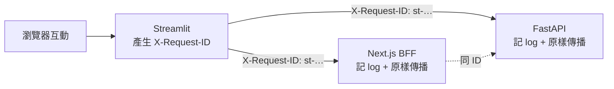

# 規格:Request ID 模組(跨服務關聯 ID)

為 Streamlit 對外的每次 HTTP 呼叫附上唯一 **關聯 ID**(`X-Request-ID`),讓 **Streamlit → Next.js BFF → FastAPI** 三端的 log 能以同一組 ID 串起來除錯,並在錯誤時把 ID 呈現給使用者回報。

- 定位:橫切關注點(observability),掛在 [API Client](auth-flow.md#6-streamlit-端模組分層可測試性--tdd) 的對外呼叫上。
- 上層骨架:[應用骨架 §6 lib 分層](app-skeleton.md#6-lib-分層總表單一入口地圖)、[§7 session_state 契約](app-skeleton.md#7-session_state-契約單一真相)。
- 前提:[ADR 0002](../decisions/0002-streamlit-as-api-client.md)(純 API Client);僅在 `DATA_SOURCE=api` 或 `AUTH_MODE=bff`(有對外呼叫)時作用,全 mock 模式下休眠。

---

## 1. 目的與範圍

**目的**
- 每個對外 HTTP 請求帶一個唯一 ID,三端 log 共用 → 一條指令即可撈出整條呼叫鏈。
- 請求 / 回應 / 錯誤都記下該 ID。
- 對外顯示錯誤時附上 ID(如「錯誤代碼:`st-a1b2…`」),供使用者回報、客服對照。

**非目標**
- **不做 traceId / 跨 App 分散式追蹤**(W3C Trace Context `traceparent`、traceId+spanId 樹狀關聯):本階段只做**單次呼叫**的 `X-Request-ID`(≈ spanId)。跨 App「一路追蹤」需一顆從前端 BFF 帶入的 traceId/correlationId,屬更上層設計,**本規格延後**;未來若需再另立追蹤規格。
- 不改變業務邏輯、不影響認證流程本身。
- 不負責 BFF / FastAPI 端的 log 落地(那是各自服務的責任,本模組只保證「發得出、記得到」)。

> **範圍界定(決策)**:`X-Request-ID` 由 Streamlit **每次對外呼叫當場生成**,用於定位**單一 hop**;它**不從前端登入/導航帶過來**(瀏覽器整頁導航無法夾帶自訂 header)。要串起「登入→跨 App」整段旅程是 **traceId/correlationId** 的職責,已明確**延後**。

---

## 2. 設計決策

| 決策 | 選擇 | 理由 / 最佳實踐 |
|---|---|---|
| Header 名稱 | 預設常數 `X-Request-ID`,可由 `lib/config.py` 覆寫 | 業界事實標準;**需與 BFF / FastAPI 對齊**(見 §7)。程式不散寫字串,統一由常數/設定取用 |
| ID 產生 | `uuid.uuid4()`(**非 `uuid1`**) | `uuid4` 為隨機;`uuid1` 會洩漏 MAC 位址與時間,不可用於對外 ID |
| ID 格式 | `st-<uuid4 hex>`(如 `st-9f2c…`,共 35 字) | 不含連字號的 32 hex + 前綴;**不編碼任何語意 / PII**,純不透明字串 |
| 前綴 | 預設 `st`,可設定 | 標示「源自 Streamlit」,log 混流時易篩;前綴僅為運維便利,下游仍當不透明字串 |
| 產生粒度 | **每個對外 HTTP 請求一個**(非每次 rerun) | 每一 hop 可獨立定位;reactive refresh 的重試自然各有其 ID |
| 源頭 vs 沿用 | Streamlit 為源頭時**生成**;若請求已帶 `X-Request-ID` 則**沿用不覆寫** | 關聯 ID 的通則:有上游 ID 就承接,無才新生,避免斷鏈 |
| Header 讀取 | **大小寫不敏感**查找 | HTTP header 名稱大小寫不敏感,回應可能是 `x-request-id` |
| 可注入性 | 產生器 `gen` 參數可替換(預設 `uuid.uuid4`) | ID 非決定性,測試注入固定 `gen` 斷言傳播,不斷言隨機值 |
| 遮蔽 | log 只記 method / path(去 query)/ status / 耗時 / rid | **絕不記** `Authorization` / cookie / token / 請求體,避免洩漏憑證 |

---

## 3. 模組介面(`lib/request_id.py`)

純函式為主,不依賴 Streamlit,便於單元測試。ID 的「當前值」以 `ContextVar` 做**環境傳遞**(讓 logging 自動帶上,不必逐層傳參):

```python
# lib/request_id.py(概念,非最終碼)
import uuid
from contextvars import ContextVar
from typing import Callable, Optional, Mapping

HEADER = "X-Request-ID"                       # 預設;實際名稱由 config 決定(§2)
_current: ContextVar[Optional[str]] = ContextVar("request_id", default=None)

def new_request_id(prefix: str = "st", gen: Callable[[], uuid.UUID] = uuid.uuid4) -> str:
    """產生關聯 ID,格式 '<prefix>-<uuid4 hex>';gen 可注入以利測試決定性。"""
    ...

def with_request_id(headers: Mapping, request_id: str, header: str = HEADER) -> dict:
    """回傳附上關聯 ID 的新 headers(不就地修改)。
    若 headers 已含該 header(大小寫不敏感)→ 沿用既有值、不覆寫(見 §2 源頭 vs 沿用)。"""
    ...

def read_request_id(response_headers: Mapping, header: str = HEADER) -> Optional[str]:
    """從回應 headers 以大小寫不敏感方式取回關聯 ID;無則 None。"""
    ...

def set_current(request_id: Optional[str]) -> None:
    """設定當前請求 ID 到 ContextVar(供 logging filter 讀取)。"""
    ...

def get_current() -> Optional[str]:
    """取當前請求 ID;無則 None。"""
    ...

def init_logging() -> None:
    """冪等:把讀 get_current() 的 logging.Filter 掛到 'streamsight.api' logger(見 §4.2)。
    由 app.py 啟動時呼叫一次;重複呼叫不重複掛載。"""
    ...
```

- **產生器可注入**:`gen` 參數預設 `uuid.uuid4`,測試傳固定 `gen` 即可斷言。
- **環境傳遞**:呼叫端在對外請求前 `set_current(rid)`,logging 的 `Filter` 從 `get_current()` 自動注入 rid(見 §4.2),避免把 rid 逐層穿參。
- 模組**無狀態(除 ContextVar)**;不寫 `session_state`(錯誤顯示的暫存見 §5)。

---

## 4. 整合點

### 4.1 API Client(主要掛載點)

`lib/api_client.py`(`ApiDataSource` 與 BFF introspection)每次對外呼叫:

1. `rid = new_request_id()`;`set_current(rid)`。
2. `headers = with_request_id(base_headers, rid)` → 送出。
3. 記 log(見 §4.2 結構化格式)。
4. 失敗(逾時 / 非 2xx)→ 拋 `ApiError`,**`.request_id = rid`**,交由上層呈現(見 §4.3)。
5. `finally`:`set_current(None)` 清掉環境值,避免跨請求殘留。

- **BFF introspection**(`GET /api/auth/session`)與 **FastAPI 業務 API** 皆掛;兩者各自產生獨立 ID。
- 與認證的 reactive refresh 併存:業務(rid=A)→ 401 → re-introspect(rid=B)→ 重試(rid=C),三段各有 ID,鏈路更清楚。

### 4.2 Logging(最佳實踐)

- **框架**:Python stdlib `logging`;固定 logger 名 `streamsight.api`(不用 root logger,便於獨立設定等級)。
- **結構化**:欄位走 `extra`,不硬串進訊息字串,利於 log 聚合器索引:
  ```python
  logger.info("api_call", extra={
      "request_id": rid, "method": method, "path": path,   # path 已去 query string
      "status": status, "elapsed_ms": elapsed})
  ```
- **等級對應**:2xx/3xx → `INFO`;4xx → `WARNING`;5xx / 逾時 / 連線錯誤 → `ERROR`。
- **遮蔽(硬性)**:只記 `path`(去 query string);**絕不記** `Authorization`、cookie、JWT、請求 / 回應 body。
- **環境注入(可選但建議)**:掛一個 `logging.Filter`,從 `get_current()` 把 `request_id` 補進**每一筆** log record;如此連非 api_client 的 log 也自帶當前 rid,無需逐處傳參。此掛載封裝為模組匯出的 `init_logging()`(冪等),由 `app.py` 啟動時呼叫一次(見 [app-skeleton §3](app-skeleton.md#3-進入點-apppy-職責與順序) 步驟 ②′)。

### 4.3 錯誤契約與呈現(UX)

- **錯誤型別**:api_client 對外一律拋 `ApiError`(於 api_client 規格定義),欄位至少:`message: str`、`status: Optional[int]`(逾時 / 連線錯誤為 `None`)、`request_id: str`。本模組只**約定 `.request_id` 屬性存在**,不負責定義 `ApiError` 本體。
- 頁面攔到 `ApiError` → 暫存 `session_state["last_request_id"]`(§5)→ `st.error("操作失敗,請稍後再試。錯誤代碼:st-a1b2…")`。
- 讓使用者能把代碼回報,對照三端 log 快速定位。

### 4.4 傳播語意



- Streamlit 是**源頭**:對外呼叫時**生成**;不從瀏覽器請求沿用(browser→Streamlit 非我方可控 header 的 API 呼叫)。
- 下游(BFF / FastAPI)應**原樣沿用**收到的 `X-Request-ID` 記 log,並在往更下游時傳播;若下游未收到則自行生成——此為**跨團隊約定**(§7)。

---

## 5. `read_request_id` 的用途、`session_state` 與快取

- **`read_request_id` 用途**:對外呼叫收到回應後,用它從回應 headers 取下游回填的 ID,與送出的 rid **比對是否一致**(驗證 echo);若下游改寫或補了自己的 ID,可一併記入 log(`downstream_request_id`),便於跨服務對照。屬**選用強化**,非必要路徑。
- 模組本身無狀態(除 §3 ContextVar);預設**不寫** `session_state`。
- 錯誤暫存:把「**最近一次失敗的 request ID**」暫存 `session_state["last_request_id"]`,供錯誤畫面顯示與回報;成功則不留。
- **不可**把 request ID 當作 `st.cache_data` 的 key 一部分(否則每次新 ID 都 cache miss,破壞快取);ID 只進 headers 與 log,不進快取鍵。

---

## 6. 可測試性 / TDD

依 CLAUDE.md,每個行為先寫失敗測試。

### 純模組(`tests/unit/test_request_id.py`)——**現在即可實作**

1. `new_request_id()` — 格式 `st-<32 hex>`;連續兩次**不相等**(唯一性)。
2. 前綴可設定 — `new_request_id(prefix="dash")` → `dash-…`。
3. **產生器可注入** — 注入固定 `gen` 後 ID 決定性。
4. `with_request_id(headers, rid)` — 回傳含 header:rid;**不就地修改**原 dict。
5. **不覆寫既有** — headers 已含 `x-request-id`(小寫)時,沿用既有值、不覆寫。
6. `read_request_id()` — **大小寫不敏感**取回(`x-request-id` 也讀得到);無則 `None`。
7. **ContextVar** — `set_current(rid)` 後 `get_current()` 回同值;`set_current(None)` 後為 `None`。

### API Client 整合(`tests/unit/test_api_client.py`)——**gated on `lib/api_client.py` 規格**

> 下列需 `api_client` 存在才可實作;現階段 mock 先行、無對外呼叫,先列不寫。

8. 每次對外呼叫 headers **含** header;兩次呼叫 ID **不同**。
9. **log**(`caplog`)— `streamsight.api` logger 出現含 `request_id` 的結構化紀錄;等級對應(2xx→INFO、5xx/逾時→ERROR)。
10. **遮蔽** — log **不含** `Authorization` / cookie / token。
11. **錯誤攜帶 ID** — 失敗時拋 `ApiError` 且 `.request_id == rid`;頁面 `st.error` 顯示、`session_state["last_request_id"]` 有值(AppTest 可選)。

---

## 7. 相依 / 待確認

- [x] **追蹤層級**:本階段**只做 per-call `X-Request-ID`**;跨 App traceId(W3C Trace Context)**延後**(見 §1 範圍界定)。
- [x] **產生 / 格式 / 遮蔽 / ContextVar / 錯誤契約**:已依最佳實踐定案(§2、§3、§4)。
- [x] **實作分段**:純模組(測 1–7)現在可實作;整合(測 8–11)gated on `lib/api_client.py`(含 `ApiError`)規格。
- [ ] **Header 名稱對齊**:BFF 與 FastAPI 是否使用 `X-Request-ID`(而非 `X-Correlation-ID` 等)?需與後端 / 前端團隊確認,並確保下游**原樣傳播 + 記 log**。
- [ ] **下游是否已生成**:若 BFF / FastAPI 已有自己的 request-id 機制,釐清「Streamlit 生成、下游沿用」還是「以下游為準」;預設採**前者**(Streamlit 為源頭),並以 `with_request_id` 的「不覆寫既有」承接上游值。
- [x] `ApiError` 的完整欄位與 `lib/api_client.py` 整體契約(httpx 選型、逾時、重試、401 refresh)——已定於 [API Client 規格](api-client.md)(§3、§4、§5);整合測 8–11 據此可實作。

---

## 8. 檔案與掛載

```
lib/
├── request_id.py     # 本模組:new / with / read + set_current / get_current(ContextVar)
├── api_client.py     # 掛載點:每次對外呼叫附 header + set_current + 結構化 log + ApiError(帶 rid)
└── config.py         # header 名稱 / 前綴設定(預設 X-Request-ID / st)
styles/…              # (無關)
tests/unit/
├── test_request_id.py # 純模組(測 1–7),現可實作
└── test_api_client.py # 整合(測 8–11),gated on api_client
```

- **logging filter**(§4.2 環境注入)置於 `lib/request_id.py`,以冪等的 `init_logging()` 匯出;於 `app.py` 啟動時掛到 `streamsight.api` logger 一次(app-skeleton §3 步驟 ②′)。

> 於 [應用骨架 §6 lib 分層總表](app-skeleton.md#6-lib-分層總表單一入口地圖)登錄本模組;骨架必要性為 **接 API 階段**(全 mock 下休眠)。
